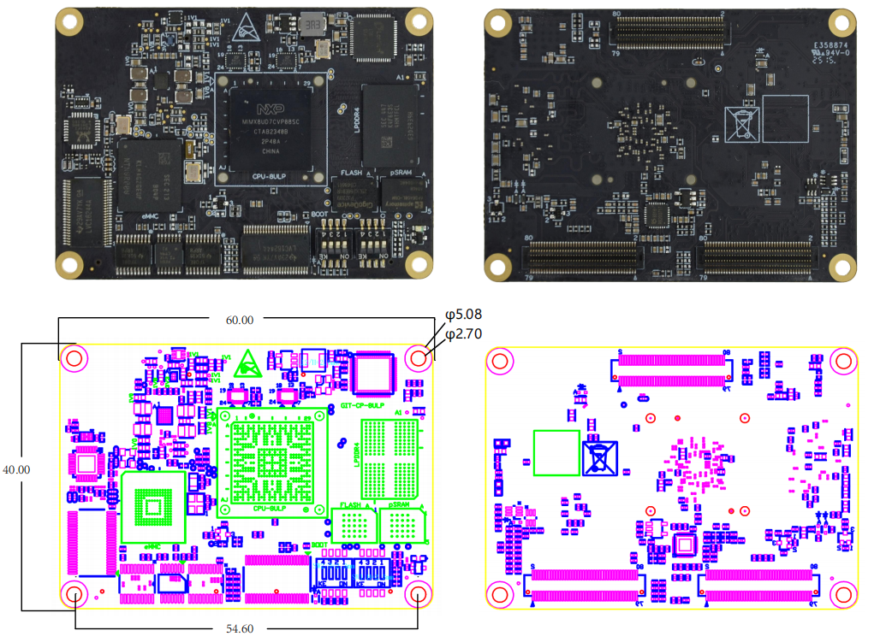

# DEBIX SOM D i.MX 91 Core Board
 

## Overview
DEBIX SOM D is a power-efficient System-on-Module product based on the NXP i.MX 8ULP process, featuring a dual-core ARM Cortex-A35 CPU (up to 800MHz) and an integrated Cortex-M33 real-time core. Designed for ultra-low-power embedded applications, it combines processing, memory, and storage in a compact form factor, streamlining carrier board development and accelerating deployment in wearables, edge computing, smart healthcare, and other power-sensitive scenarios.

## Main Features
- **Ultra-low Power Consumption:** Advanced power management and energy-efficient architecture make it ideal for always-on and battery-operated applications.
- **Scalable and Flexible Design:** Compact module with versatile interface support, enabling easy integration into a wide range of embedded applications.
- **Real-time Performance:**  Integrated ARM Cortex-M33 core enables real-time processing, secure operations, and efficient task offloading from the main application processor.

 

 

### Specification:

| **System**       |             |
|------------------|-------------|
| CPU              | NXP i.MX 8ULP, 2 x Arm® Cortex®-A35 @800MHz, 1 x Arm® Cortex®-M33 @216MHz. The maximum power consumption is 0.738W. (i.MX 8ULP series CPU optional) |
| Memory           | 2GBLPDDR4 (1GB optional) |
| Storage          | Onboard16GBeMMC (8GB/32GB/64GB/128GB/256GB optional) |
| OS               | Yocto-L6.12.3_1.0.0, Debian 12, Android 15 (also supports FreeRTOS) |
| **I/O Interfaces** |             |
| Ethernet         | Up to 1 x Ethernet controller (10/100Mbps) |
| Display          | 1xMIPIDSI (4-lane)   Up-to 24-bit RGB (DBI/DPI) |
| Camera           | 1xMIPICSI (2-lane), supports up to 2MP |
| Audio            | 1xSAI(synchronousaudiointerface), 1xSPDIFOUT/IN, 1 x PDM |
| USB              | 2 x USB 2.0 |
| LPUART           | Up to 8 x LPUART |
| LPI2C            | Up to 8 x LPI2C |
| SDIO             | Up to 2 x SDIO |
| CAN/CAN FD       | Up to 1 x CAN/CAN FD |
| LPSPI            | Up to 5 x LPSPI |
| ADC              | Up to 2 x ADC(12-bit) |
| DAC              | Up to 2 x DAC(12-bit) |
| Analog Comparator| Up to 2 x Analog Comparators |
| **Power Supply** |             |
| Power Input      | DC 3.5V~5V/1A |
| **Operating Temperature** | |
| Temp. Range      | -40°C~85°C for default, -20°C~70°C optional |
| **Mechanical & Environmental** | |
| Connector        | 3 x 2*40pin/0.5mmpitchboard-to-boardconnector (PN: BB51024A-R80-40-32), matching socketsofvariousheights |
| Dimension        | 60mm(L) x 40mm(W) x 9.0mm(H) (±0.5mm) |
| Gross Weight     | 17g (±0.5g) |
| Net Weight       | 29g (±0.5g) |

<!--
## Product Compliance and Safety
CE | FCC | UKCA | RoHS | C-Tick | PSE  
*For more information see [the Certificates in the DEBIX Knowledge Center](https://debix.io/Document/certificates.html)*  

## Ordering Codes
| RAM LPDDR4 | eMMC Storage | PN (-20°C~70°C) | PN (-40°C~85°C) |
|------------|--------------|-----------------|-----------------|
| **1GB DDR**| 8GB          | SOM C-D1E8      | SOM C-I-D1E8    |
|            | 16GB         | SOM C-D1E16     | SOM C-I-D1E16   |
|            | 32GB         | SOM C-D1E32     | SOM C-I-D1E32   |
|            | 64GB         | SOM C-D1E64     | SOM C-I-D1E64   |
| **2GB DDR**| 8GB          | SOM C-D2E8      | SOM C-I-D2E8    |
|            | 16GB         | SOM C-D2E16     | SOM C-I-D2E16   |
|            | 32GB         | SOM C-D2E32     | SOM C-I-D2E32   |
|            | 64GB         | SOM C-D2E64     | SOM C-I-D2E64   |

## Compatible with DEBIX's Accessories
| Product                     | Model               |
|-----------------------------|---------------------|
| SOM A I/O Board             | BMB-08              |
-->

## Safety Instructions and Warnings:
**General:**
- Avoid exposure to water, moisture and conductive surfaces while operating.
- Handle with care to avoid mechanical or electrical damage to the circuit board and connectors.
- Only handle the board by the edges when powered on to minimize the risk of electrostatic discharge damage.

**Power:**
- Use the product with a carrier board and connect it to a 3.5V~5V/1A external power supply that complies with relevant regulations and standards for your country.

**Environment:**
- Operate in a well-ventilated environment, even if using a case.
- Place on a stable, flat, non-conductive surface and avoid contact with conductive items.

**Connections:**
- Use peripherals that comply with relevant standards for the country of use and ensure proper insulation and operation.

**Additional notes:**
- This summary is not exhaustive, please refer to the full User Manual for details.
- If you are unsure about any aspect of safety or operation, consult a qualified
professional.

## Contact Us
- **Headquarters**: DEBIX Technology Inc., 8345 Gold River Ct., Las Vegas, NV 89113, USA  
- **Factory**: 5-6/F., East Zone, Shunheda A2 Building, Liqxiandong Industrial Park, XiLi, Nanshan Dist., Shenzhen, China  
- **Email**: info@debix.io  
- **Website**: [www.debix.io](https://www.debix.io)  
- **Community**: [Discord](https://discord.com/invite/adaHHaDkH2)